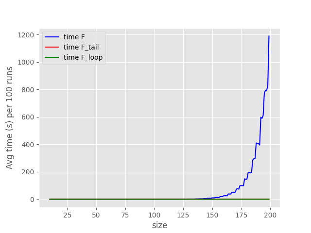
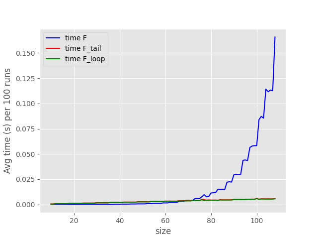
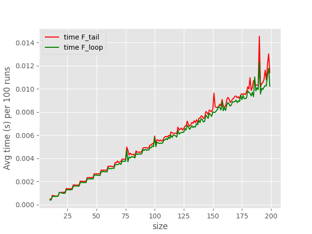

# Analisis de resultados

Por si acaso, se puede ver el codigo en: [TailRec.py](./TailRec.py)

Al correr muestras de tamano 10-200 (repitiendo el experimento 100 veces por muestra):

<center>



</center>

Es evidente el comportamiento exponencial de la funcion recursiva, la cual domina a las otras dos versiones.

Incluso si cortamos el dataset a la mitad, la funcion recursiva sigue dominando casi de la misma forma:

<center>



</center>

Por lo tanto, para poder analizar las otras dos implementaciones, excluiremos la funcion directamente recursiva:

<center>



</center>

Y aqui vemos que la funcion recursiva de cola, es casi una traslacion perfecta de la funcion iterativa, lo cual tiene muchisimo sentido, puesto que la funcion iterativa es una traduccion directa de la funcion recursiva de cola, y el tiempo adicional que esta ultima paga, siempre es mas o menos el mismo: crear un nuevo marco en la pila para continuar, y luego desempilarlo.

## Profiler

Una forma mas divertida de ver esto, es viendo interactivamente los resultados que da el profiler.

Para esto, primero necesitamos instalar [snakeviz](https://jiffyclub.github.io/snakeviz/)

Y luego, solo tenemos que ejecutar:

```bash
$ snakeviz .\TailRec.prof
```

Dentro del profiler, no solo se ve casi la misma informacion (para una muestra de hasta 100) sino que tambien se puede ver la cantidad de llamadas que se hizo a cada funcion, and the results are wild!

Para una muestra de hasta 100, la cantidad de llamadas recursivas que hace `F` esta en el orden de $10^5$, mientras que la version de cola esta en $10^2$, lo cual, considerando que ambas funciones tienen un cuerpo similar is nuts.